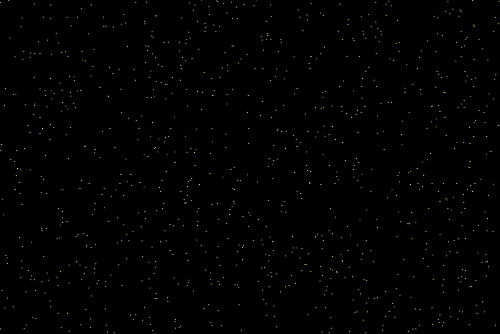

# Particle Tracking & Clustering Simulation

A real-time 2D simulation that explores object tracking under noisy measurements using particle filtering, clustering, and temporal smoothing.

---

## Overview

This project simulates multiple moving objects in a noisy environment and tracks them over time using a probabilistic particle filter. Measurements are intentionally noisy, requiring robust clustering and temporal tracking.

Objects are not directly observed. Instead, the system estimates their positions from noisy measurements using weighted particles and groups observations using DBSCAN clustering.

---

## Visualization


*Real-time particle filter state estimation tracking multiple moving target objects under synthetic measurement noise.*

---

## Features

* Noisy synthetic sensor measurements
* Particle filter for probabilistic state estimation
* DBSCAN clustering for detection grouping
* Track management with motion prediction
* Simple shape-based feature extraction (covariance eigenvalue ratio)
* Temporal smoothing for more stable tracking

---

## Controls

* SPACE → Pause / Resume
* RIGHT ARROW → Step frame
* O → Toggle objects
* P → Toggle particles
* M → Toggle measurements
* C → Toggle cluster display

---

## Repository Structure

```text
Particle_filter-master/
├── assets/
│   ├── demo.gif                    # Particle Filter demo animation showing tracking in action
├── src/
│   ├── clustering.py               # DBSCAN clustering on particle cloud and covariance eigenvalue extraction
│   ├── constants.py                # Global parameters, window dimensions, particle counts, and ratios
│   ├── main.py                     # Primary entry point; initializes Pygame window and runs main loop
│   ├── object_class.py             # Simulates moving objects, motion bounds, and synthetic measurement noise
│   ├── particle_class.py           # Particle representation, prediction, weight update, and resampling
│   └── tracker.py                  # Multi-target tracker, data association, track lifecycle, and shape classification
├── .gitignore
├── environment.yml
└── README.md
```

---

## Dependencies

- Python 3.12
- NumPy
- SciPy
- scikit-learn
- pygame

---

## Usage
```bash
conda env create -f environment.yml
conda activate particle-filter

python src/main.py
```


